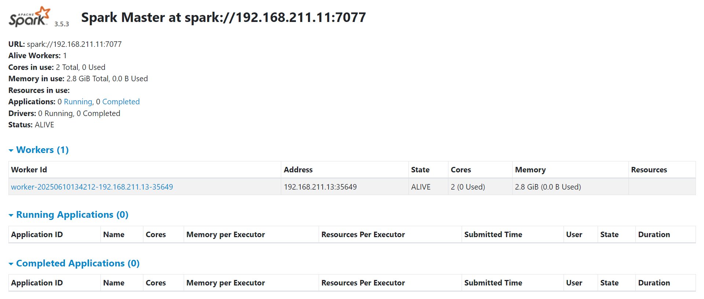

## Yêu cầu hệ thống

Trước khi cài đặt, hãy đảm bảo bạn đã có sẵn:
- Hai máy chạy hệ điều hành **Ubuntu** (hoặc hệ thống tương tự Unix) và đã cài đặt **Hadoop 3.x**
- Cả hai máy phải kết nối chung một mạng LAN (ping được nhau)
- Đã cài đặt **Java 8+** trên cả master và slave
- Đã thiết lập **SSH** giữa master và slave

---

## Cấu hình hệ thống

| Role     | IP Address       | Username          |
|----------|------------------|-------------------|
| Master   | `192.168.211.11` | `hadoopthienphuc` |
| Slave    | `192.168.211.13` | `hadoopthienphuc` |

---

## Tải và cài đặt Spark

Trên **máy master**, thực thi lệnh sau để tải Spark về máy. 

```bash
wget https://www.apache.org/dyn/closer.lua/spark/spark-3.5.6/spark-3.5.6-bin-hadoop3.tgz
```

Sau đó giải nén và đổi lại tên thư mục thành `spark` để dễ sử dụng.

```bash
tar -xvf spark-3.5.6-bin-hadoop3.tgz
mv spark-3.5.6-bin-hadoop3 spark
```

---

## Copy thư mục Spark từ master sang slave

Trên **máy master**, thực hiện lệnh:

```bash
scp -r ~/spark hadoopthienphuc@192.168.211.13:~/
```

Lệnh này sẽ copy toàn bộ thư mục Spark từ master sang slave qua SSH.

---

## Thêm biến môi trường Spark vào `.bashrc`

Trên **cả master và slave**, mở file `.bashrc`:

```bash
vi ~/.bashrc
```

Thêm đoạn sau vào cuối:

```bash
export SPARK_HOME=/home/hadoopthienphuc/spark
export PATH=$PATH:$SPARK_HOME/bin
export PATH=$PATH:$SPARK_HOME/sbin
export PYTHONPATH=$SPARK_HOME/python:$SPARK_HOME/python/lib/py4j-0.10.9.7-src.zip
```

Sau đó apply ngay:

```bash
source ~/.bashrc
```

---

## Cấu hình môi trường Spark

Tạo file `spark-env.sh` nếu chưa có:

```bash
cp $SPARK_HOME/conf/spark-env.sh.template $SPARK_HOME/conf/spark-env.sh
```

Mở file cấu hình:

```bash
vi $SPARK_HOME/conf/spark-env.sh
```

Thêm cấu hình sau:

```bash
export SPARK_MASTER_HOST=192.168.211.11
export JAVA_HOME=/usr/lib/jvm/java-1.8.0-openjdk-amd64
export SPARK_WORKER_MEMORY=2g  # tuỳ theo dung lượng RAM máy bạn
```

---

## Copy file cấu hình sang máy slave

Từ **máy master**, chạy:

```bash
scp $SPARK_HOME/conf/spark-env.sh hadoopthienphuc@192.168.211.13:$SPARK_HOME/conf/spark-env.sh
```

---

## Khai báo máy worker trong Spark

Trên **máy master**, chỉnh file `slaves` (hoặc `workers`):

```bash
vi $SPARK_HOME/conf/slaves
```

Thêm IP hoặc hostname của máy slave:

```
192.168.211.13
```

> Lưu ý: Nếu bạn dùng Spark bản mới hơn, file này có thể tên là `workers`

---

## Khởi động Spark Cluster

Từ máy master, chạy:

```bash
$SPARK_HOME/sbin/start-all.sh
```

Lệnh này sẽ:
- Khởi động Spark Master
- SSH sang slave và khởi động Spark Worker

---

## Kiểm tra giao diện Spark UI

Mở trình duyệt và truy cập:

🔗 [http://192.168.211.11:8080](http://192.168.211.11:8080)



Bạn sẽ thấy thông tin:
- Spark Master đang chạy
- Worker được kết nối (từ IP `192.168.211.13`)


